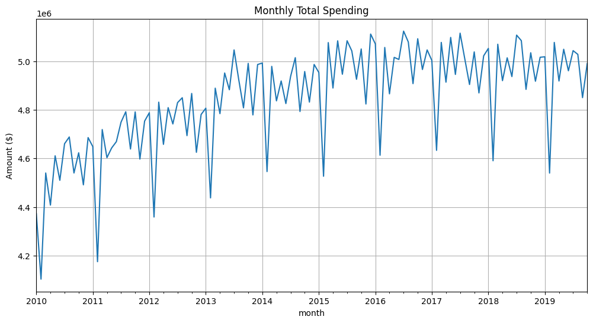
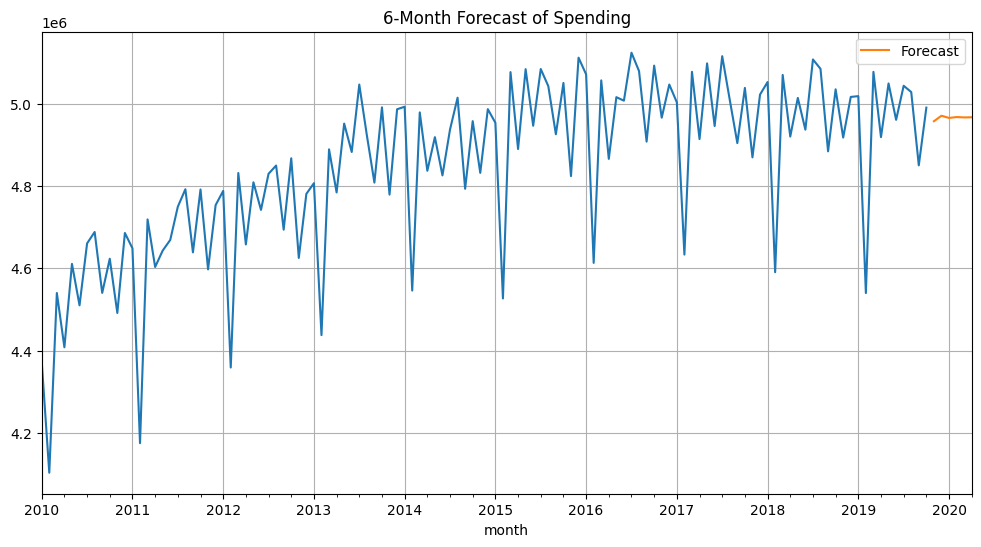
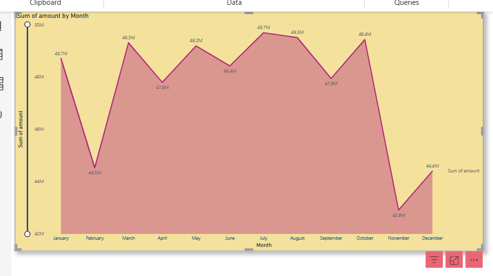

#  Financial Forecasting Project

This project analyzes transaction-level data and forecasts monthly spending using **Python** and **Power BI**. The analysis includes **ARIMA time-series modeling** and dashboarding to uncover customer spending patterns.

##  Files Included

- **`cards_data.csv`**, **`users_data.csv`**, **`transactions_data.csv`** → Raw input datasets.  
- **`monthly_totals.csv`** → Aggregated monthly totals for time-series analysis.  
- **`transaction_forecasting.ipynb`** → Jupyter Notebook for data cleaning, modeling, and forecasting.  
- **`forecast.py`** → Script for automating ARIMA forecasts.  
- **`spending_forecast_dashboard.pbix`** → Power BI dashboard file.  
- **`spending_forecast_dashboard.png`** → Snapshot of the final dashboard.  

##  Features

✅ **Exploratory Data Analysis (EDA)**  
✅ **Time-series forecasting using ARIMA**  
✅ **Dynamic visualizations**  
✅ **Power BI interactive dashboarding**  

##  Setup Instructions

1. **Clone the repository**  
   ```
   git clone https://github.com/Srivyshnavi29/Financial-Forecasting.git
   cd Financial-Forecasting
   ```

2. **Install dependencies**  
   ```
   pip install -r requirements.txt
   ```

3. **Run the forecasting model**  
   ```
   python forecast.py
   ```
##  Output




##  Technologies Used

- **Python** (Pandas, NumPy, Scikit-learn, Statsmodels)  
- **Jupyter Notebook**  
- **Power BI**  
- **Git & GitHub**
